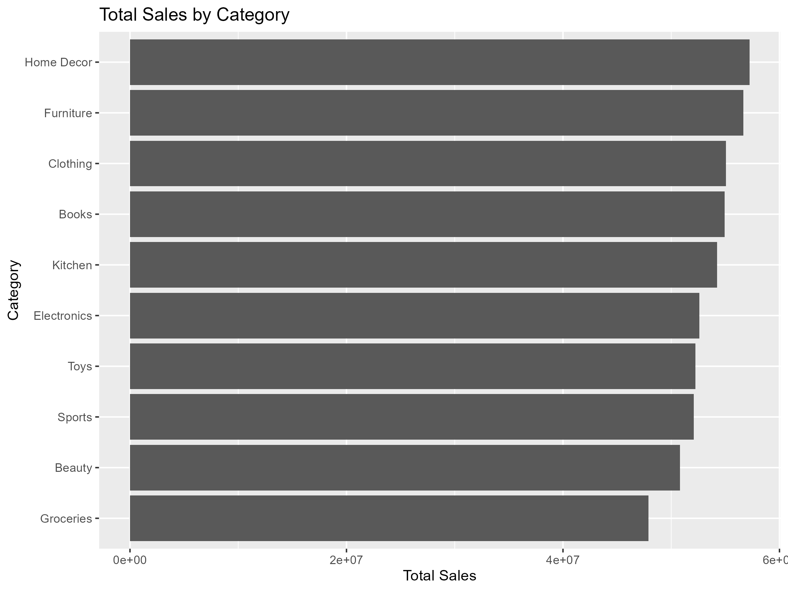
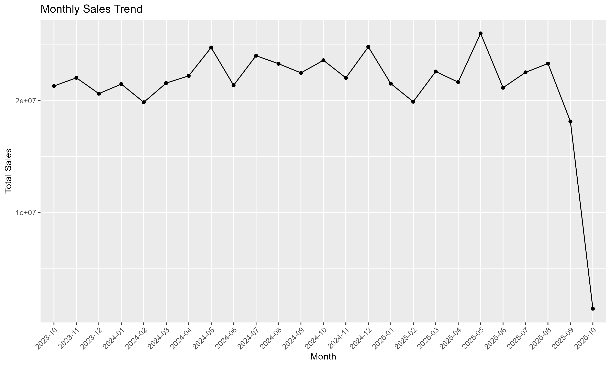
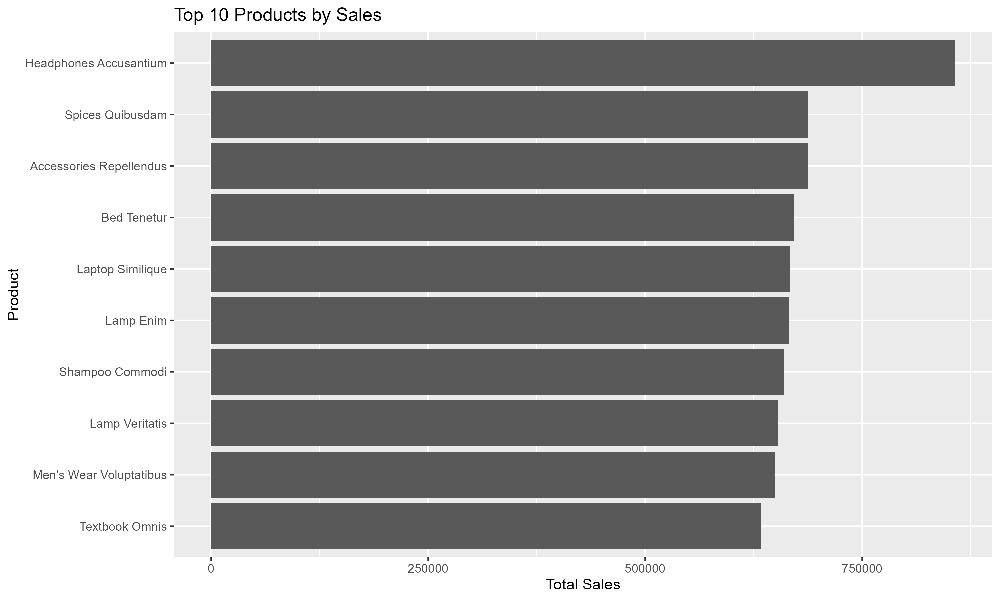
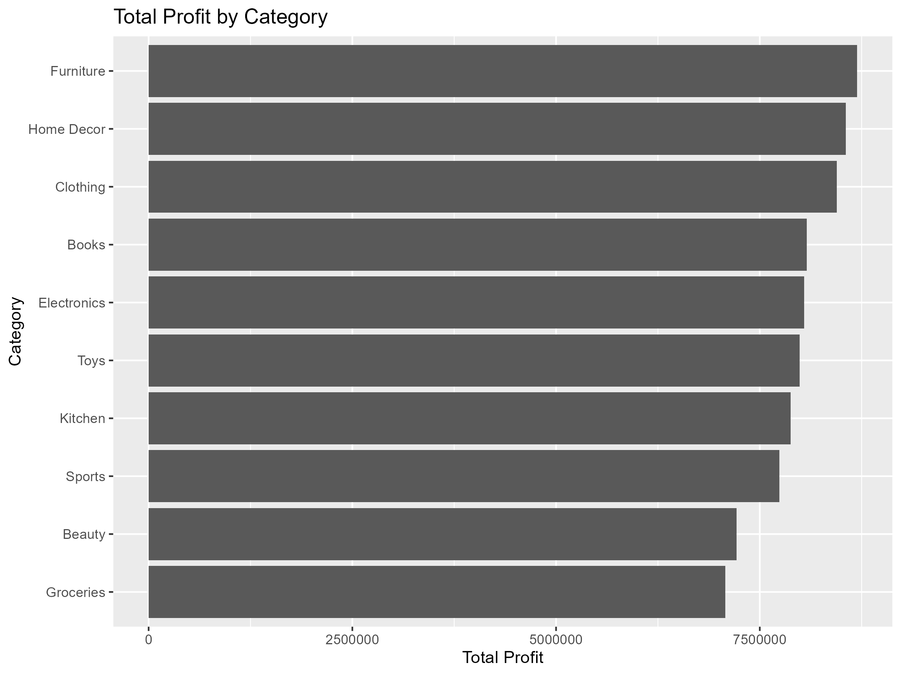
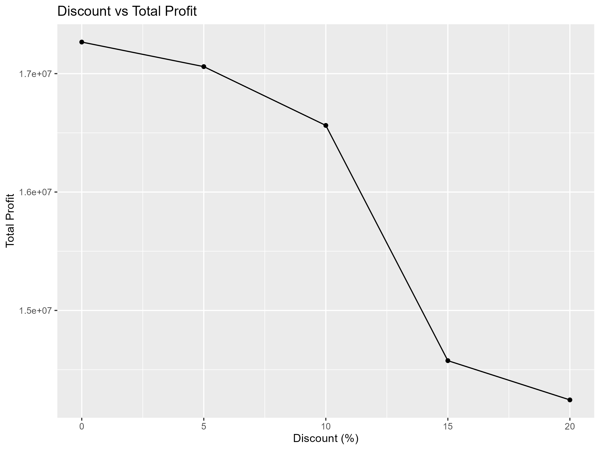
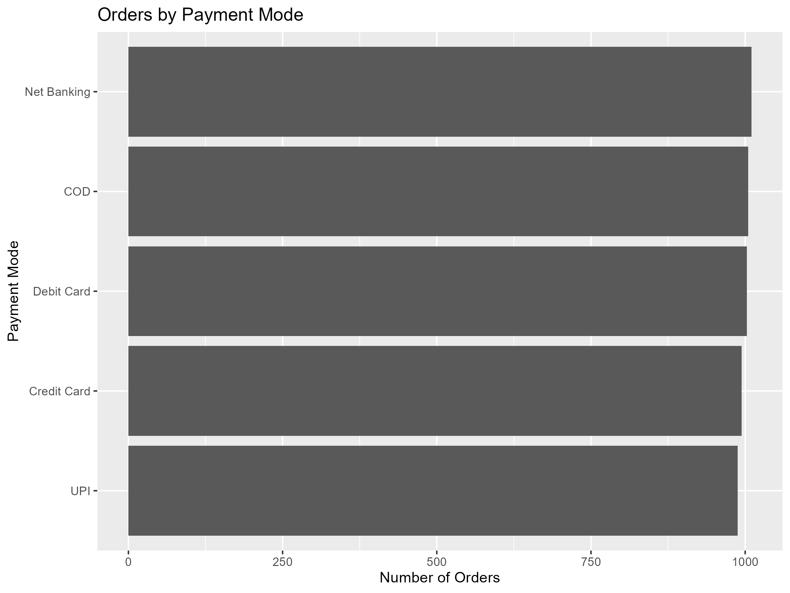
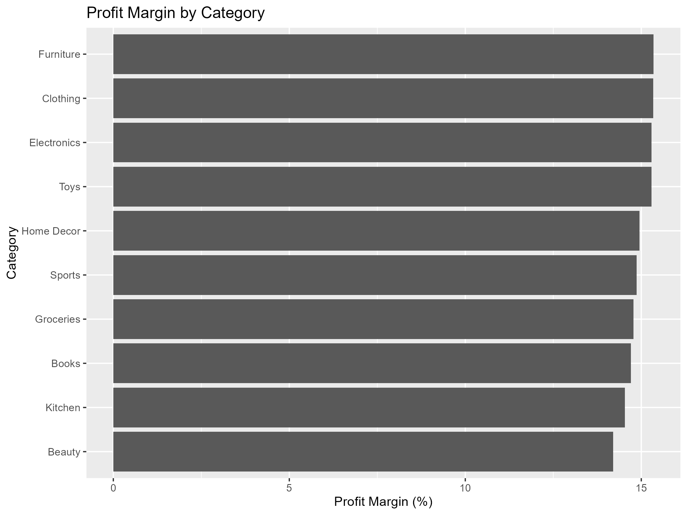
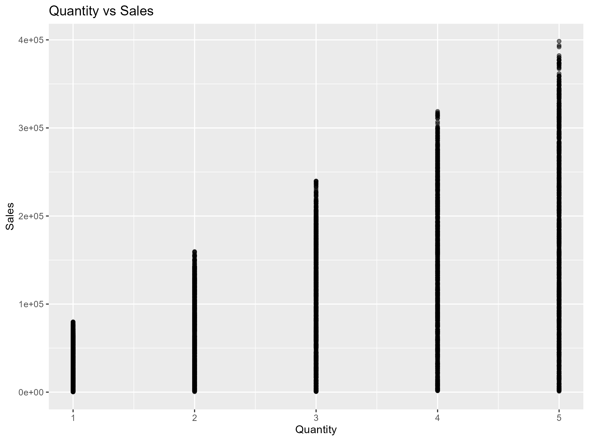
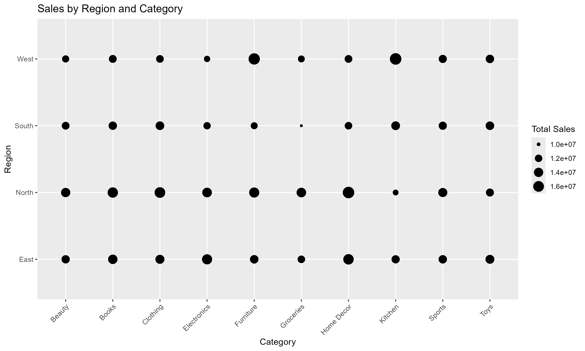

# E-Commerce Sales and Profitability Analysis Using R

## 📌 Project Overview

This project analyzes e-commerce sales data using R programming to understand sales performance, profitability, customer behavior, product performance, regional performance, and discount patterns.

The project uses data cleaning, data manipulation, statistical analysis, and data visualization techniques to generate meaningful business insights from the sales dataset.

## 🎯 Objectives

The main objectives of this project are:

- Analyze total sales and profit by product category
- Identify the best-performing region
- Analyze monthly sales trends
- Identify top-selling products
- Identify high-value customers
- Analyze the effect of discounts on profit
- Analyze customer payment preferences
- Calculate profit margin by category
- Analyze the relationship between quantity and sales
- Generate useful business insights using visualizations

## 📊 Dataset

The dataset used in this project is:

`Ecommerce_Sales_Data_2024_2025.csv`

The dataset contains:

- 5,000 records
- 14 columns

### Dataset Columns

| Column | Description |
|---|---|
| Order.ID | Unique order ID |
| Order.Date | Date of the order |
| Customer.Name | Customer name |
| Region | Customer region |
| City | Customer city |
| Category | Product category |
| Sub.Category | Product sub-category |
| Product.Name | Product name |
| Quantity | Number of units purchased |
| Unit.Price | Price per unit |
| Discount | Discount percentage |
| Sales | Total sales amount |
| Profit | Profit generated |
| Payment.Mode | Payment method |

## 🛠️ Tools and Technologies

- R
- Tidyverse
- dplyr
- ggplot2
- lubridate
- CSV Dataset
- GitHub

## 🔄 Project Workflow

The project follows these major steps:

1. Import the dataset
2. Understand the dataset structure
3. Perform data cleaning
4. Check missing values
5. Check duplicate records
6. Convert date columns
7. Perform descriptive statistics
8. Analyze category-wise sales and profit
9. Analyze region-wise performance
10. Analyze monthly sales trends
11. Identify top products and customers
12. Analyze discounts and profit
13. Analyze payment modes
14. Calculate profit margins
15. Create visualizations
16. Generate business insights

## 🧹 Data Cleaning

The following data-cleaning operations were performed:

- Checked dataset dimensions
- Checked column names
- Checked data types
- Checked missing values
- Checked duplicate records
- Converted `Order.Date` into Date format

### Data Quality Results

- Total Records: **5,000**
- Missing Values: **0**
- Duplicate Records: **0**

This indicates that the dataset did not contain missing values or duplicate rows.

## 📈 Analysis Performed

### 1. Category-wise Sales Analysis

Sales and profit were calculated for each product category.

**Key finding:**

- Home Decor generated the highest total sales.
- Total sales were approximately **57.23 million**.

### 2. Region-wise Sales Analysis

Sales and profit were analyzed for each region.

**Key finding:**

- The **North region** generated the highest total sales.
- Total sales were approximately **143.58 million**.
- Total profit was approximately **21.34 million**.

### 3. Monthly Sales Trend

Monthly sales were analyzed to understand changes in sales over time.

The analysis helps identify:

- High-performing months
- Low-performing months
- Sales fluctuations
- Seasonal patterns

### 4. Top 10 Products

The top 10 products were identified based on total sales.

**Top product:**

`Headphones Accusantium`

- Total Sales: **857,184**
- Total Profit: **141,874**
- Total Quantity Sold: **14**

### 5. Profit by Category

Profit was calculated for each product category.

**Key finding:**

- Furniture generated the highest total profit.
- Total profit was approximately **8.69 million**.

### 6. Discount Analysis

Different discount levels were compared with sales and profit.

The dataset contains discounts of:

- 0%
- 5%
- 10%
- 15%
- 20%

**Key finding:**

Higher discount levels generally resulted in lower average profit.

The 5% discount group had the highest average profit per order in this dataset.

### 7. Payment Mode Analysis

Orders, sales, and profit were analyzed based on payment mode.

This helps understand customer payment preferences and the contribution of different payment methods.

### 8. Top 10 Customers

Customers were ranked based on total sales.

**Top customer:**

`Aaryahi Madan`

- Total Sales: **650,152**
- Total Profit: **107,156**
- Total Orders: **3**

### 9. City-wise Sales Analysis

Sales, profit, and number of orders were analyzed for different cities.

This helps identify strong-performing cities and potential markets.

### 10. Profit Margin by Category

Profit margin was calculated using:

```text
Profit Margin = (Total Profit / Total Sales) × 100
**Key finding**

Furniture had the highest profit margin.
Profit margin was approximately 15.3%.
## 11. Quantity vs Sales

A scatter plot was created to understand the relationship between quantity purchased and sales amount.

## 12. Region and Category Analysis

Sales were analyzed using both region and product category.

This helps identify which categories perform well in different regions.

📊 Visualizations

The following visualizations were created using ggplot2:

### Total Sales by Category


### Monthly Sales Trend


### Top 10 Products


### Total Profit by Category


### Discount vs Profit


### Orders by Payment Mode


### Profit Margin by Category


### Quantity vs Sales


### Sales by Region and Category

All visualization images are stored in the visualizations folder.

💡 Key Business Insights
Home Decor generated the highest total sales.
Furniture generated the highest total profit.
Furniture also had the highest profit margin.
North was the best-performing region by sales.
Headphones Accusantium was the top-selling product.
Aaryahi Madan was the highest-value customer based on total sales.
Higher discounts generally reduced average profit.
The 5% discount group showed the highest average profit per order.
Monthly sales showed noticeable variations across the analysis period.
Payment mode analysis provides insights into customer payment preferences.
📁 Project Structure
E commerce-R
│
├── Ecommerce_Sales_Data_2024_2025.csv
├── e commerce.R
├── README.md
│
└── visualizations
    ├── category_sales.png
    ├── monthly_sales_trend.png
    ├── top_10_products.png
    ├── profit_by_category.png
    ├── discount_vs_profit.png
    ├── payment_mode_orders.png
    ├── profit_margin_category.png
    ├── quantity_vs_sales.png
    └── region_category_sales.png
▶️ How to Run the Project
1. Install R

Install R from the official R website.

2. Install Required Packages

Run:

install.packages("tidyverse")
install.packages("lubridate")
3. Load Packages
library(tidyverse)
library(lubridate)
4. Set the Working Directory

Set the working directory to the project folder.

setwd()
5. Run the R Script

Open:

e commerce.R

Run the script to perform the analysis and generate the visualizations.

📌 Key R Techniques Used

The project uses several important R concepts:

read.csv()
head()
dim()
names()
str()
summary()
is.na()
duplicated()
group_by()
summarise()
arrange()
mutate()
ggplot()
geom_col()
geom_line()
geom_point()
slice_max()
🚀 Future Enhancements

The project can be further improved by adding:

Interactive dashboard using R Shiny
Sales forecasting
Customer segmentation
RFM analysis
Product recommendation analysis
Regional maps
Advanced statistical analysis
Interactive filters
Automated sales reports
📝 Conclusion

This project demonstrates the use of R for real-world e-commerce data analysis.

The analysis identifies important patterns in sales, profit, products, customers, regions, payment modes, and discounts.

The results can help businesses make better decisions related to product management, pricing, discount strategies, customer management, and regional sales planning.

👩‍💻 Author

Durga Vyshnavi

B.Tech – Artificial Intelligence and Data Science

📄 License

This project is created for educational, academic, and portfolio purposes.
